> 一个为思源笔记设计的增强型搜索插件，支持通过输入指令字符灵活控制搜索行为。

---

## 📣 写在前面

- 本插件的**核心逻辑与使用方式**参考自 [简易搜索插件](https://github.com/choyy/simple-search)。
- 若你从中受益，请感谢原作者：[choyy](https://github.com/choyy)，或通过[爱发电支持他](https://afdian.com/a/chooyy)。
- 本人仅为二次开发与功能扩展，**非原作者**。如有问题请联系我（见下文），但感谢请归于原作者。
- 致 choyy 大佬：感谢开源，侵删即改！

---

## ⚠️ 非常重要！

1. **版本要求**：本插件基于思源笔记 **v3.2.1+** 新增的事件接口实现，**最低需使用 v3.2.1 或更高版本**。
2. **互斥警告**：本插件与「简易搜索」插件**完全互斥**。若要使用本插件，请务必**彻底卸载「简易搜索」**（仅关闭开关无效）。
3. **遇到问题？**
   - 先尝试重启思源笔记；
   - 若仍存在异常，请前往 [链滴社区 @HugZephyr](https://ld246.com/member/HugZephyr) 联系我，或在[链滴帖子](https://ld246.com/article/1759810985885)下留言，或提交 [GitHub Issue](https://github.com/Hug-Zephyr/HZ-syplugin-simple-search/issues)。

---
## 最近更新

### [2025/11/20_14:55:23] `develop_v1.3.4_highlight`
- [增加] issue #39 通过 双击/回车 跳转到对应位置后, 高亮关键词/闪烁当前块/定位光标

### [2025/11/14_10:50:45] `develop_v1.3.3_optimize`
- [修复] issue #35 搜索历史没有识别html特殊字符, 导致无法输入`"`等问题

### [2025/11/03_22:05:06] `develop_v1.3.2_optimize`
- [增加] issue #31 搜索结果增加平铺模式
- [修复] issue #33 适配浅吟主题

### [2025/10/26_12:22:03] `develop_v1.3.1`
- [增加] issue #28 支持删除某个搜索历史

### [2025/10/23_19:33:39] `release_v1.3`
* [增加] issue #19 支持文档模式, 通过`-e`控制按照文档维度进行搜索
* [增加] issue #21 支持通过`-/`排除指定路径
* [增加] issue #22 支持过滤时间

---

## 🔧 使用方法

本插件兼容原「简易搜索」的全部功能，可无缝切换使用。

在搜索框中输入格式：  
`-<指令字符> <关键词>`: 即可实现对搜索方式、块类型、路径等的精准控制。

例如：
`-dhc 历史用户`: 表示搜索包含“历史用户”的**文档块(`d`)**、**标题块(`h`)** 和 **代码块(`c`)**。

可通过辅助信息显示框, 反馈/查看帮助/直观显示插件解析生效结果/修改设置
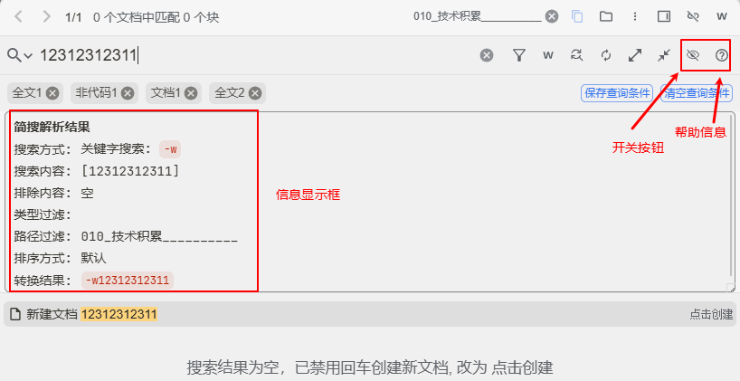

---

## ✨ 功能详解

### 1. 指定搜索方式

启动插件后, 会通过解析搜索内容, 自动设置搜索方式, 无法再手动修改方式  
比如: 当输入内容包含插件可识别的指令（如 `-dh`）时，会自动转换为 SQL 查询。  
若想**强制使用某种搜索模式**，可通过以下字符指定：

| 字符 | 模式             |
|------|------------------|
| `w`  | 关键字搜索       |
| `q`  | 查询语法         |
| `s`  | SQL 语句         |
| `r`  | 正则表达式       |

> ✅ 指定后会自动勾选对应搜索模式，无需手动勾选(手动勾选也不生效)。  
> ❌ 若不希望触发插件解析，避免以 `-` 开头或使用未注册字符。

#### 示例

- `-w-dh`：以**关键字模式**搜索包含 `-dh` 的内容  
  
- `-q中国历史 NOT 苏联`：使用查询语法排除“苏联”  
  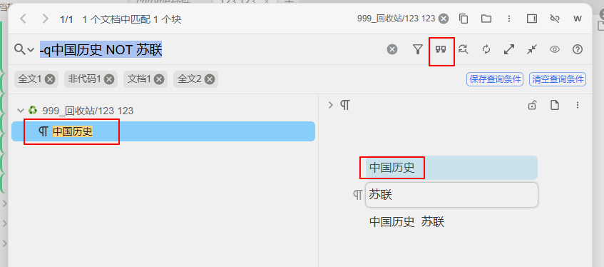
- `-sselect * from blocks where content like '%历史%';`：执行原生 SQL  
  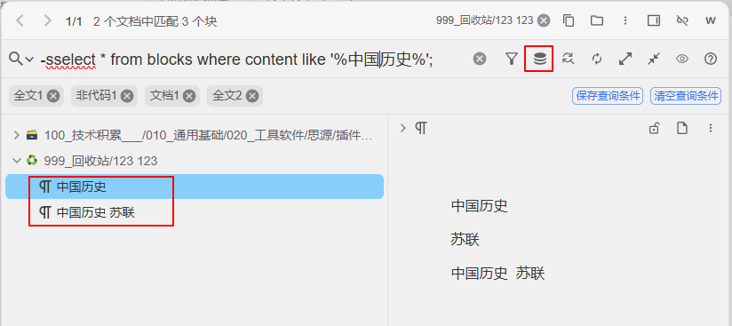

> 这里的四个字符必须放在前面才会生效, `中国历史 -w`是不会被识别到的
---

### 2. 指定块类型（核心功能）

#### (1) 默认行为
未指定块类型时，沿用搜索页面当前勾选的类型。

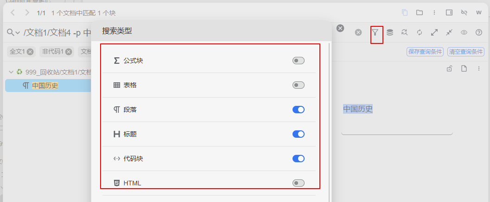

#### (2) 自定义过滤
使用 `-` + `类型字符`，精确筛选目标块类型。

例如：
`历史 -dhi`或`-dhi 历史`: 表示搜索包含“历史”的**文档块(`d`)**、**标题块(`h`)**、**列表项块(`i`)**，结果也按此顺序排序。

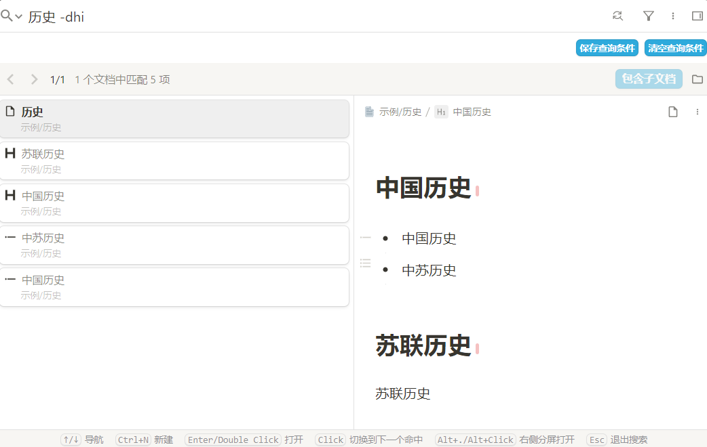

#### ✅ 支持的块类型

> 可通过插件新增的帮助面板随时查看。

| 字符 | 类型说明 |
|------|----------|
| `d` | 文档块（仅匹配文档名） |
| `h` | 标题块（仅匹配标题文本） 支持等级过滤：`h`+数字1-6，如 `-h13` 表示搜索 1, 3 级标题 |
| `p` | 段落块 |
| `c` | 代码块 |
| `b` | 引述块 |
| `L` | **大写 L**：含外部链接的块（非标准类型） |
| `l` | **小写 l**：列表块（有序/无序/任务列表） |
| `i` | 列表项块 |
| `s` | 超级块 |
| `t` | 表格块 |
| `m` | 数学公式块 |
| `o` | **小写 o**: 未完成待办项（todo） |
| `O` | **大写 O**: 已完成待办项（done） |

---

### 3. 指定搜索路径

#### (1) 默认路径
未指定时，沿用搜索面板当前选定的路径范围。

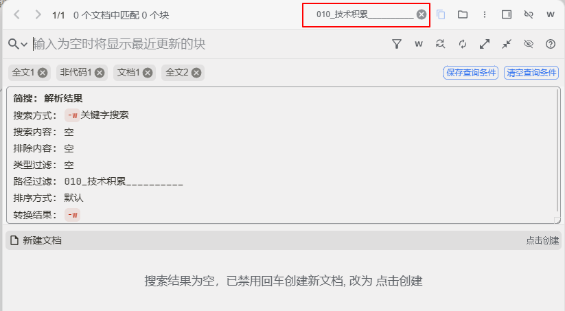

#### (2) 指定当前文档

- `k`：**小写 k**仅当前文档
- `K`：**大写 K**当前文档及其子文档

> ✅ 可与其他过滤条件组合使用。

##### 示例
`历史 -中苏 -kphi` → 在当前文档中搜索含“历史”但不含“中苏”的段落(`p`)、标题(`h`)、列表项(`i`)块。

#### (3) 多层路径匹配（使用 `/`）

通过 `/` 指定路径中的层级关键词
通过 `-/` 排除掉 路径中的包含关键词的内容

- `//`: 取消页面选定的路径, 强制搜索所有笔记本  
  `//文档1/文档2`  → 以`//`开头, 在全部笔记本下搜索 路径包含 `文档1` 且文档名包含 `文档2` 的文件

- **无关键词时**：仅搜索文档名称  
  `/笔记本1/文档1/文档2`  → 搜索 路径包含 `笔记本1`,`文档1` 且文档名包含 `文档2` 的文件。

  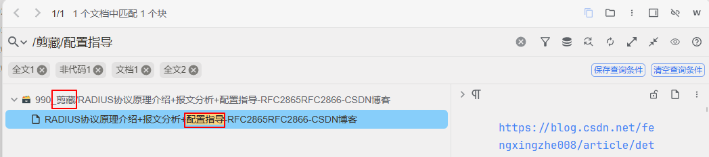

- **有关键词时**：按关键词搜索 + 路径匹配  
  `/文档1/文档3 中国历史 -hp`  → 搜索 路径包含 `文档1`,`文档3` 且内容含“中国历史”的标题块(`h`)和段落块(`p`)。

    
  

- `-/文档1/文档3 中国历史 -hp`  → 搜索 路径不包含 `文档1`,`文档3` 且内容含“中国历史”的标题块(`h`)和段落块(`p`)。

> 🔍 **注意**：
> 1. 默认路径、当前文档(`k/K`)、全部文档`//` 互斥，三者只能选其一；
> 2. 多层路径可与上述任一路径条件**组合使用（AND 关系）**；
> 3. 多层路径为**模糊匹配但顺序严格**：  
>    - `/f1/f3` 可匹配 `/f1/f2/f3` 或 `/ff11/f2/f3`   
>       但不能匹配 `/f3/f1`
> 4. 多层路径可以**同时存在多个**:  
>    - 多个路径之间是 and 的关系  
>       `//f1/f2 /f3/f4 name`: 在全部笔记本下搜索 路径包含 `f1/f2` 且包含 `f3/f4`, 包含`name`的块
>    - 无关键词时, 取第一个路径的最后一个当文件名   
>       `//f1/f2 /f3/f4`: 在全部笔记本下搜索 路径包含 `f1` 且包含 `f3/f4`, 文档名包含`f2`的文档

---

### 4. 指定时间

本功能支持通过关键字过滤创建时间/更新时间(最后一次更新)

#### 关键字

| 关键字            | 说明       |
|-------------------|-----------|
| `ct<`             | 创建时间   |
| `ct>`             | 创建时间   |
| `ct=`             | 创建时间   |
| `ut<`             | 更新时间   |
| `ut>`             | 更新时间   |
| `ut=`             | 更新时间   |

#### 示例

* `ct<2025 中国`: 查询在2025年1月1号 00:00:00之前创建的`中国`
* `ct=202511 中国`: 查询在2025年11月创建的`中国`
* `ut>20241020112233 中国`: 查询 2025年10月20号 11:22:33之后更新的`中国`
* `ct>2024|ct<2021 ut>2022&ut<2023 中国`: (ct>2024|ct<2021) & (ut>2022&ut<2023)  
   支持`&`和`|`操作, 多个分开的关键词之间使用`&`

---

### 5. 排序功能

本功能支持通过关键字控制是否按文档分组以及搜索结果的排序方式。

支持灵活组合配置，优先级规则如下：**手动指定 > 页面配置**。

#### 🔧 关键字说明

##### 📦 分组控制
| 关键字           | 说明       |
|-----------------|------------|
| `g<` / `g>`     | 按文档分组  |
| `nog<` / `nog>` | 不分组     |

##### 🔁 排序控制
| 关键字            | 排序方式       | 说明                        |
|-------------------|---------------|----------------------------|
| `type<` / `type>` | 类型排序       |                            |
| `ct<`             | 创建时间升序   | 越早创建的排在前面           |
| `ct>`             | 创建时间降序   | 最近创建的排在前面           |
| `ut<`             | 更新时间升序   | 越早更新的排在前面           |
| `ut>`             | 更新时间降序   | 最近更新的排在前面           |
| `cont<` / `cont>` | 原文内容顺序   | 按原文中出现的顺序排列       |

> 💡 **小贴士**：  
> - 尖头指向左侧（`<`）表示 **升序（从小到大）**，指向右侧（`>`）表示 **降序（从大到小）**。  
> - `type` 和 `cont` 类型的排序不依赖尖头的朝向。  

---

#### 🧩 排序逻辑详解

##### ✅ 不分组模式（`nog<` 或 `nog>`）
- **类型排序（`type<` / `type>`）**  
  支持。例如：`name -cph type>` 表示结果按类型排序：代码块 → 段落块 → 标题块。

- **相关度排序**  
  ❌ 不支持。由于无法通过 SQL 模拟思源原生相关度功能，此模式下相关度排序无效，无论手动指定或页面配置均不起作用。

- **原文内容排序（`cont<` / `cont>`）**  
  ❌ 不支持。不分组时不支持，此选项将被忽略。

- **其他排序方式（`ct`, `ut`）**  
  ✅ 正常支持。

- **多排序叠加**  
  ✅ 支持多个排序条件依次生效。例如：  
  `name -cph type>ct>ut<`  
  含义：先按类型排序（标题→段落→代码），类型相同时按创建时间降序，再相同时按更新时间升序。

---

##### 📁 按文档分组模式（`g<` 或 `g>`）
- 此模式下, 思源会强制按照内置排序逻辑修改排序结果，插件无法干预最终排序结果。
- 所有排序方式的效果与 **不使用插件时一致** (文档按照路径名升序)。

- **特殊说明：相关度排序**  
  在分组模式下，“相关度”实际表现为 **按类型排序**（类似 `type<`），并非真正的语义相关性。(属于原有效果)

- **多排序条件处理**  
  ❌ 不支持多个排序方式叠加。若指定多个，**仅第一个有效**，其余将被忽略。

---

#### 🔄 组合使用示例

| 命令示例 | 效果说明 |
|--------|---------|
| `name -cph type>g<ct>ut<` | 按文档分组；组内排序以类型降序为主（仅第一个生效），其余排序条件忽略 |
| `name -cph type>nog<ct>ut<` | 不分组；先按类型降序，再按创建时间降序，最后按更新时间升序 |

**✅ 提示**
* 分组与排序可同时设置，互不影响语法解析，但需注意不同模式下的实际行为限制。
* 指定分组/排序再取消指定后, 会恢复指定前的分组/排序方式

---

### 6. 其他高级功能

#### 🔺 关键词排除

在关键词后添加 `-`+`排除词`，实现排除特定内容。

支持多关键词排除，并可与块类型组合。

##### 示例
`历史 -中苏 -美国 -dhi` → 搜索含“历史”但不含“中苏”和“美国”的文档/标题/列表项块。

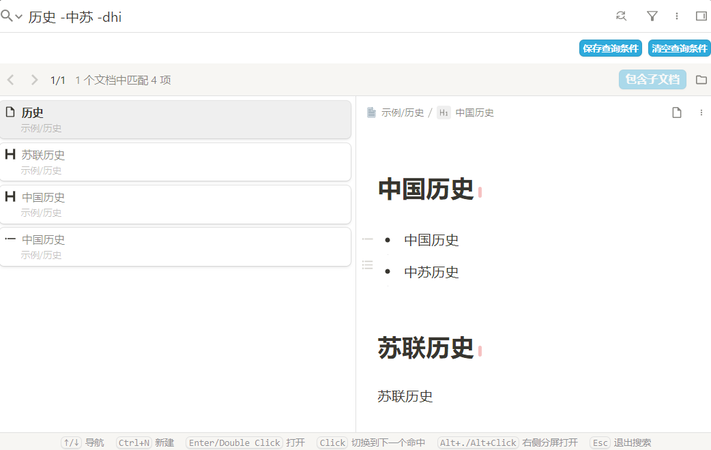

#### 🔺 文档模式（-e）

使用 `-e` 实现 以文档为维度 进行搜索
* `中国历史 苏联历史 -e` → 搜索**同时包含“中国历史”和“苏联历史”** 的文档。

* `中国 美国 -he -苏联` → 在**同时包含“中国”, "美国", 且不包含“苏联”** 的文档下, 搜索含"中国"或者"美国"的标题块

---

## 🛠️ 其他功能与特性

### 💡 辅助信息显示框

搜索页面新增四个按钮和一个信息显示区：

- **显示与隐藏**: 控制 跳转按钮,设置按钮和信息显示区域 的显示/隐藏
- **信息显示区**：
  + 搜索后更新显示内容, 自动将插件解析结果和转换后的实际搜索语句显示出来, 方便调试与确认搜索意图是否正确解析。  
    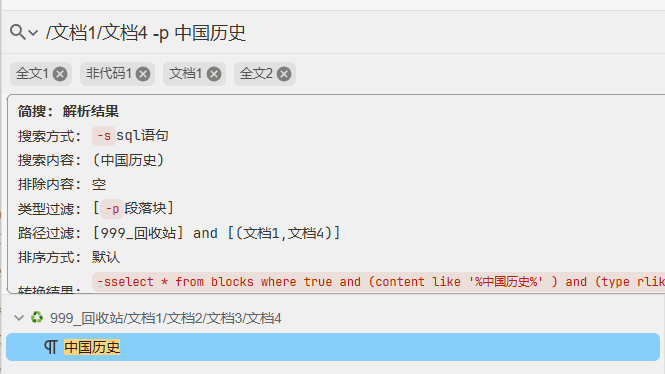
- **帮助信息按钮**: 在信息框显示区里, 展示插件支持的所有语法, 方便在忘记的时候, 快速查看  
  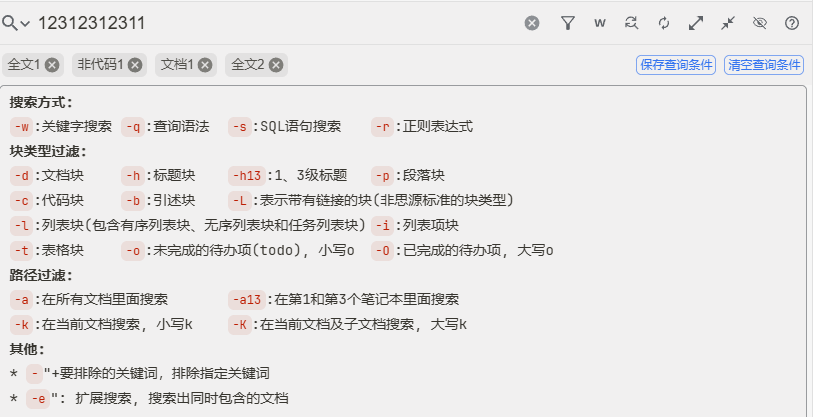
- **跳转按钮**: 使用默认游览器打开本插件的readme, 里面有反馈问题的链接
- **设置按钮**: 在信息框显示区域里显示可修改的设置
  

#### 接管搜索历史
- 效果如下:  
  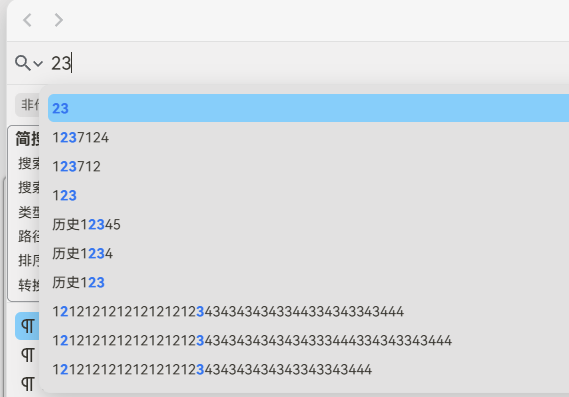
- **接管历史记录**: 开启后, 可通过alt+↓切换历史记录列表显示与隐藏, 以及打开自动显示的开关;  
  可通过alt+↑隐藏历史记录, 以及关掉自动显示的开关  
  备注: 关闭后, 不会影响自动显示开关; 思源原生的历史记录依旧可以通过点击进行正常操作
- **自动显示历史记录**: 开启后, 在搜索框输入内容会先匹配搜索历史, 点击/回车后才会触发真正的搜索  
  备注: 完全匹配到/完全没匹配到的时候, 不会自动显示. 如果开启了接管开关, 可通过快捷键强制拉起

#### 接管搜索结果(仅在分组下生效)
  + 原生列表: 不改变搜索结果样式, 只改变文档的顺序  
  + 原生树/多彩树/eDiary树: 按照树结构显示  
    
  + 树结构下 搜索结果优先  
    
  + 树结构下 显示全路径  
    

---

### ✅ 其他优化体验

- 适配**搜索历史记录**：点击历史项仍可被插件识别
- 当无匹配文档时，**禁用回车创建新文档**，防止误操作  
  
- 在发布模式下禁用插件

---

## 🐞 已知问题（待处理）

---

## 🍰 未来规划（画饼）

> （以下功能暂无排期）

---

## 📅 更新日志

### [2025/11/27_21:01:39] `develop_v1.3.6_cursor_position`
- [优化] issue #43 支持三种光标定位的效果: 前/选中/后, 且在光标不可见时, 自动滚动

### [2025/11/20_15:43:47] `develop_v1.3.5_fix`
- [修复] issue #41 `接管搜索结果` 开关 无法修改

### [2025/11/20_14:55:23] `develop_v1.3.4_highlight`
- [增加] issue #39 通过 双击/回车 跳转到对应位置后, 高亮关键词/闪烁当前块/定位光标

### [2025/11/14_10:50:45] `develop_v1.3.3_optimize`
- [修复] issue #35 搜索历史没有识别html特殊字符, 导致无法输入`"`等问题

### [2025/11/03_22:05:06] `develop_v1.3.2_optimize`
- [增加] issue #31 搜索结果增加平铺模式
- [修复] issue #33 适配浅吟主题

### [2025/10/26_12:22:03] `develop_v1.3.1_optimize`
- [增加] issue #28 支持删除某个搜索历史
- [优化] issue #30 在快速切换的时候, 选中的会不在可见区域内
- [修复] issue #29 `-/`没有过滤笔记本名字

### [2025/10/25_23:31:58] `release_v1.3`
- 发布v1.3版本

### [2025/10/23_19:33:39] `develop_v1.2.3_optimize`
- [增加] issue #19 支持文档模式, 通过`-e`控制按照文档维度进行搜索
- [增加] issue #21 支持通过`-/`排除指定路径
- [增加] issue #22 支持过滤时间
- [修复] issue #18 适配发布模式, 插件在发布模式下禁用
- [修复] issue #20 在sql方式下, 使用多个关键词时, 只会高亮最后一个关键词
- [修复] issue #23 使用sql方式搜索时, 代码块里面的内容不会高亮
- [修复] issue #24 使用 -hL的时候, sql拼接的有问题
- [修复] issue #25 指定了分组/排序方式搜索之后, 取消指定, 不会恢复指定前的方式
- [修复] issue #26 在思源3.3.5上, 搜索预览不高亮

### [2025/10/18_15:08:57] `develop_v1.2.2_optimize`
- [修复] issue #7 存在替换框的时候, 上下键失效
- [修复] issue #12 使用搜狗输入法在中文情况下, 输入`/`, 会触发两次input事件
- [优化] issue #10 暗黑主题下, 选中的历史记录高亮太违和
- [优化] issue #11 搜索和弹历史记录会同时发生

### [2025/10/15_21:29:07] `develop_v1.2.1_optimize`
- [修复] issue #6 搜索结果树双击不会打开文档
- [修复] issue #7 在文档内上下键失效

### [2025/10/14_17:22:50] `release_v1.2`
- 发布v1.2版本

### [2025/10/11_20:20:16] `develop_v1.1.1_optimize`
- [增加] 设置持久化, 重启思源后, 不会重置为默认
- [增加] 接管历史记录, 输入搜索内容后, 自动弹出匹配到的搜索历史
- [修复] 相同路径的搜索结果, 无法全部显示的bug
- [修复] 搜索结果树的情况下, 上下键没有按照新文档树的顺序来
- [优化] issue#4: 搜索时会增加搜索 命名,别名,备注, 与思源原生保持一致
- [优化] 上下键的时候, 不再遍历折叠起来的结果

### [2025/10/06_17:34:45] `release_v1.1`
- 发布v1.1版本

### [2025/09/28_17:55:20] `develop_v1.0.2_optimize_sort`
- [增加] 支持通过输入指定排序方式
- [增加] 支持通过输入指定是否按文档分组
- [增加] 接管搜索结果显示, 按照文档树的结构, 而不是平铺
- [增加] 支持设置页面, 控制搜索结果样式
- [优化] 帮助页面, 增加点击跳转反馈和查看帮助
- [修改] 取消`-a`, 改用`//`
- [修复] 优化指定路径的逻辑
- [修复] 高亮逻辑偶尔运行出错

### [2025/08/07_17:45:34] `develop_v1.0.1_optimize`
- [修复] kK无法使用
- [修复] 不按文档分组, 点第一个搜索结果会创建文档
- [优化] 辅助信息内容

### [2025/08/01 23:34:49] `release_v1.0`
- ✅ 初始发布版本，实现基础功能集
- ✅ 支持块类型过滤、路径控制、搜索方式切换、关键词排除等核心功能
- ✅ 提供辅助信息面板与帮助文档

---

## 🤝 贡献与反馈

- GitHub 仓库：[HZ-syplugin-simple-search](https://github.com/Hug-Zephyr/HZ-syplugin-simple-search)
- 提交 Issue：[点击提交问题](https://github.com/Hug-Zephyr/HZ-syplugin-simple-search/issues)
- 社区交流：[链滴 @HugZephyr](https://ld246.com/member/HugZephyr)

---

> 感谢你使用本插件！愿你在知识管理的路上越走越远 🌿