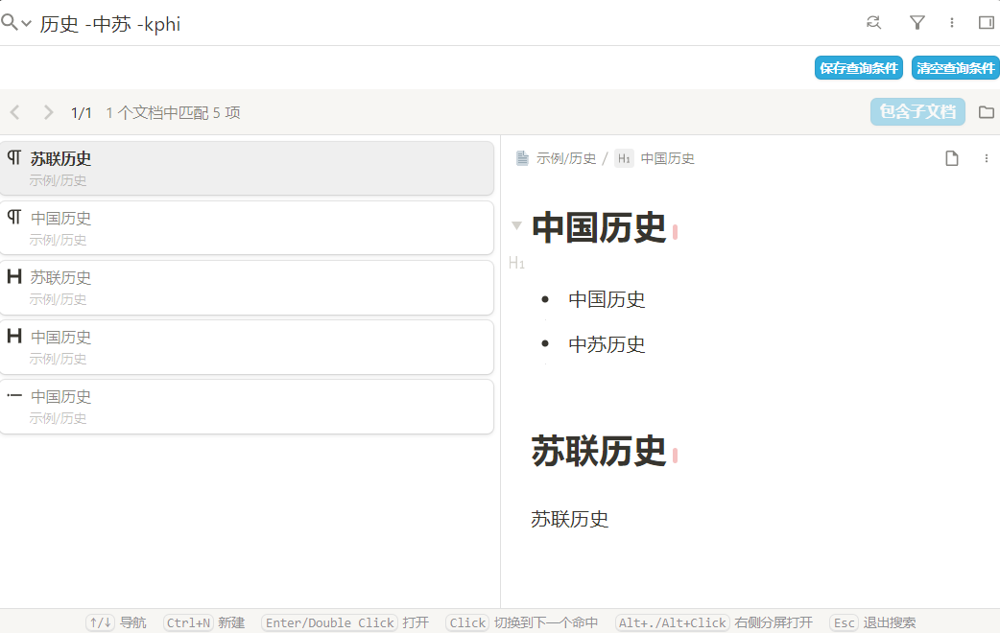
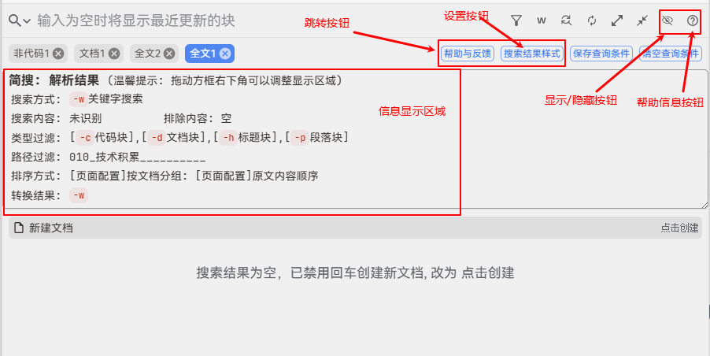

## 写在前面
* 本插件的使用方法和核心转换逻辑参考了[简易搜索这个插件](https://github.com/choyy/simple-search)
* 因此 如果你想感谢, 请联系[原插件作者(chooyy)](https://github.com/choyy)或[点击这里给大佬捐赠](https://afdian.com/a/chooyy), 而不是我
* 写给chooyy大佬: 感谢, 侵删!

## 非常重要 ! ! !
1. 本插件是基于思源3.2.1版本新增的事件接口实现的, 所以最低版本要求3.2.1
2. 本插件与 简易搜索插件互斥, 如果要使用本插件, **一定要卸载简易搜索, 就算关闭开关也不行**
3. 如果发现页面有问题, 重启下思源试试, 如果还有bug, 请在链滴社区联系我([HugZephyr](https://ld246.com/member/HugZephyr)), 或者提[issue](https://github.com/Hug-Zephyr/HZ-syplugin-simple-search/issues)

## 使用方法
> 本插件基本包含原插件(简易搜索)的所有功能, 所以可以无缝切换到本插件进行食用

在搜索框输入 `-`+`指定的字符`+`搜索关键词`, 以此控制搜索的选项  
比如: `-dhc 历史用户`: 搜索包含`历史用户`的`文档块`, `标题块`, `代码块`  

可以控制的搜索选项有
1. 指定 搜索方式
2. 指定 块类型 **核心**
3. 指定 路径
4. 其他: 排除关键词/搜索范围扩展

### 指定 搜索方式

想要搜索的内容 有可以被插件识别到的格式, 比如`-dh`等, 那插件就会自动将输入转换成sql语句然后进行搜索  
当不想让插件识别时, 可以通过输入对应的字符, 来强制使用某种搜索方式  

> 通过输入指定的搜索方式, 会自动勾选, 不需要手动勾选  
> 也可以不输入, 然后通过手动勾选进行搜索, 只要输入的字符不被插件识别到, 就不影响原来的效果

搜索方式对应字符如下：
* `w`: (keywords)关键字
* `q`: (query syntax)查询语法
* `s`: (SQL)SQL语句搜索
* `r`: (regex)正则表达式

例如:
* `-w-dh`: 使用关键字`-w`搜索出`-dh`  
  
* `-q中国历史 NOT 苏联`: 使用查询语法搜索`中国历史 NOT 苏联`  
  
* `-sselect * from blocks where content like '%历史%';` : 使用对应的SQL搜索  
  

### 指定 块类型, 最重要

#### 1. 默认块类型
未指定时, 默认使用页面上勾选的类型

#### 2. 指定块类型
使用`-`+`块类型`, 以此控制 指定类型的块

例如
`历史 -dhi` 或 `-dhi 历史`: 搜索包含`历史`的文档块(`d`)、标题块(`h`)以及列表项块(`i`)  
  同时搜索结果会按照输入的块类型排序，如上述搜索会按照文档块(`d`)、标题块(`h`)以及列表项块(`i`)的顺序排序。

目前支持的块类型如下：
> 可通过搜索页面新增的信息显示框随时查看

* `d`: 文档块(仅在文档名上搜索，不会搜索文档包含内容块)
* `h`: 标题块(仅在标题名上搜索，不会搜索标题块下方内容块)  
  + `h`+`数字1-6`: 指定标题等级，如`-h123`表示搜索 1、2、3 级标题
* `p`: 段落块
* `c`: 代码块
* `b`: 引述块
* `L`: 大写L, 表示带有链接的块，非思源标准的块类型
* `l`: 小写l, 列表块(包含有序列表块、无序列表块和任务列表块)
* `i`: 列表项块
* `s`: 超级块
* `t`: 表格块
* `m`: 数学公式块
* `o`: 未完成的待办项(todo)  
  + `O`: 已完成的待办项

### 指定 搜索路径
#### 1. 默认使用路径
未指定路径时, 默认使用搜索页面的路径

#### 2. 指定笔记本

* `a`: 全部已打开的笔记本  
* `a`+`数字1-9`: 指定在第几个打开的笔记本下面搜索  
  `-a13`: 表示在第1,3个打开的笔记本下面搜索

#### 3. 指定当前文档
* `k`: 小写k, 在当前文档搜索  
* `K`: 大写K, 可在当前文档及子文档搜索

`-k`和`-K`可以与搜索类型过滤、关键词排除结合使用。

例如:
`历史 -中苏 -kphi`: 在当前文档中搜索包含`历史`但不包含`中苏`的段落块(`p`)、标题块(`h`)以及列表项块(`i`)  
  同时搜索结果会按照输入的块类型排序。

#### 4. 指定多层路径
通过 `/` 指定搜索路径上包含的字符, **备注: 这里不需要`-`**    
* 没有搜索内容时, 搜索文档名称  
  `/笔记本1/文档1/文档2`: 搜索 路径中包含`笔记本1`/`文档1` 且 名字包含`文档2`的文档  
  
* 指定了关键词时, 就按照关键词搜索 且 需要匹配路径  
  `/文档1/文档3 中国历史 -hp`: 搜索 路径包含`文档1`/`文档3` 且 包含`中国历史`的 `标题块(h)`/`段落块(p)`  
    
  

**备注**
1. 前三种互斥, 不能同时存在
2. 多层路径 可以与 前三种的任意一种 搭配在一起使用, 与的关系, 表示都得符合  
3. 多层路径是模糊匹配, 但顺序是强制的  
  `/f1/f3` 会搜出 `/f1/f2/f3` / `/ff11/f2/f3`
  但是不能搜出 `/f3/f1`

### 其他
#### 关键词排除
搜索时在关键词后输入`-`+`要排除的关键词`即可搜索关键词并排除指定关键词  
并且关键词排除与搜索类型过滤可搭配使用。

例如
* `历史 -中苏 -美国 -dhi`: 搜索包含`历史`但不包含`中苏`且不含`美国`的文档块(`d`)、标题块(`h`)以及列表项块(`i`)  
  同时搜索结果会按照输入的块类型排序。  
  

#### 搜索范围扩展
搜索时在关键词后输入`-e`(extension)即可搜索同时包含`中国历史`和`苏联历史`的文档，注意`-e`不可与搜索类型过滤、当前文档搜索结合使用。

## 其他功能 & 特性

### 辅助信息显示框
搜索页面增加两个按钮和一个信息显示框

* 开关按钮: 控制信息显示框的 显示和隐藏
* 帮助信息按钮: 显示如下的帮助信息, 方便随时查看如何过滤某种块类型  
  同时也可以 控制信息显示框的 显示和隐藏  
  
* 信息显示框: 显示 经插件转换后的搜索内容  
  

### 其他
* 搜索框默认填充最近一次非空的记录
* 适配搜索历史; 点击搜索历史之后, 插件依旧可以正常识别
* 适配查询条件: 点击保存的查询条件之后, 插件依旧可以正常识别
* 搜索不到文档时, 禁用回车创建文档, 可以通过鼠标点击进行创建  
  
* 搜索结果按照此规则排序: 笔记本id升序+路径名称升序+更新时间降序
* 

## 待处理

### 已知问题
* 排序暂时还没怎么处理
* 扩展搜索适配的不太完善

### 新功能(画饼)
> 大概率不会处理
* 搜索页面, 增加插件开关
* 增加 插件设置页面
* 输入时, 实时更新下拉框, 显示匹配到的搜索历史

## 更新日志

### [2025/08/01_23:34:49] release_v1.0
* [basic] 基础版本, 梦开始的地方

